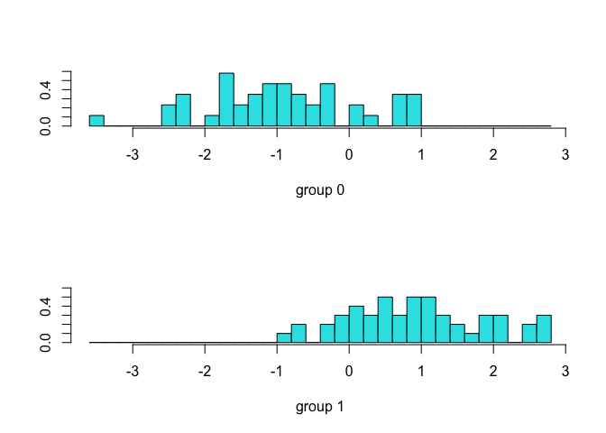

1st\_analysis
================
Zongchao
8/2/2021

# Import & check data

``` r
# import
ori_full_155 = read_csv("./data/菌有155个_ori-full.csv")
ratio_full_155 = read_csv("./data/菌有155个_比值_full.csv")
ori_full_413 = read_csv("./data/413_ori.csv")
ratio_full_413 = read_csv("./data/413_比.csv")

# simple check
#skimr::skim(ori_full_155)
#skimr::skim(ori_full_155)
#sum(names(ori_full_155) != names(ratio_full_155)) # 0
```

# Data transformation

``` r
# transformation
data_transform = function(data = ori_full_155, trans_col = c(3:415)){
# standardize
standardize = function(x){
  return((x-mean(x))/sd(x))
}
# 
data[,trans_col] = apply(log2(data[,trans_col]), MARGIN = 2, standardize)
return(data) # return log2-transformed and standardized data
}

ori_full_155_transformed = data_transform(ori_full_155,trans_col = 6:160)
ratio_full_155_transformed = data_transform(ratio_full_155, trans_col = 6:160)
ori_full_413_transformed = data_transform(ori_full_413)
ratio_full_413_transformed = data_transform(ratio_full_413)
```

# Simple multiple test

``` r
#ori_full_155_transformed
#ratio_full_155_transformed

p.list = NULL
for (var in c(3:415)) {
  p = t.test(ori_full_413_transformed[ori_full_413_transformed$group == 0, var], ori_full_413_transformed[ori_full_413_transformed$group == 1, var])
  p.list[var-2] = p$p.value
}
t_ori_413 = names(ori_full_413_transformed)[3:415][which(p.list < 0.05)]

p.list = NULL
for (var in c(3:415)) {
  p = t.test(ratio_full_413_transformed[ratio_full_413_transformed$group == 0, var], ratio_full_413_transformed[ratio_full_413_transformed$group == 1, var])
  p.list[var-2] = p$p.value
}

t_ratio_413 = names(ratio_full_413_transformed)[3:415][which(p.list < 0.05)]
```

# Linear discriminant analysis (LDA)

## ORI

``` r
library(caret)
```

    ## Loading required package: lattice

    ## 
    ## Attaching package: 'caret'

    ## The following object is masked from 'package:purrr':
    ## 
    ##     lift

``` r
library(MASS)
trRow = createDataPartition(y = ori_full_413_transformed$group, p = 0.7, list =F)
lda.fit  = lda(factor(group) ~ ., data = ori_full_413_transformed[,c("group",t_ori_413)], subset = trRow)
plot(lda.fit)
```

<!-- -->

``` r
# visualize
ori_plot_df_train = cbind(ori_full_413_transformed[trRow,]$group, as.matrix(ori_full_413_transformed[trRow,t_ori_413]) %*% lda.fit$scaling) %>% data.frame()

ori_plot_df_test = cbind(ori_full_413_transformed[-trRow,]$group, as.matrix(ori_full_413_transformed[-trRow,t_ori_413]) %*% lda.fit$scaling) %>% data.frame()

ori_plot_df_train %>%
  mutate(ID = 1:nrow(ori_plot_df_train)) %>%
  ggplot(aes(x = reorder(ID, LD1), y = LD1, fill = factor(V1))) +
  geom_col() +
  theme_bw() +
  ggsci::scale_fill_lancet() +
  ggtitle("LDA score")
```

<!-- -->

``` r
ori_plot_df_test %>%
  mutate(ID = 1:nrow(ori_plot_df_test)) %>%
  ggplot(aes(x = reorder(ID, LD1), y = LD1, fill = factor(V1))) +
  geom_col() +
  theme_bw() +
  ggsci::scale_fill_lancet() +
  ggtitle("LDA score")
```

<!-- -->

## RATIO

``` r
set.seed(12)
trRow = createDataPartition(y = ratio_full_413_transformed$group, p = 0.7, list =F)
lda.fit  = lda(factor(group) ~ ., data = ratio_full_413_transformed[,c("group", t_ratio_413)], subset = trRow)
plot(lda.fit)
```

<!-- -->

``` r
# visualize
ratio_plot_df_train = cbind(ratio_full_413_transformed[trRow,]$group, as.matrix(ratio_full_413_transformed[trRow,c(t_ratio_413)]) %*% lda.fit$scaling) %>% data.frame()

ratio_plot_df_test = cbind(ratio_full_413_transformed[-trRow,]$group, as.matrix(ratio_full_413_transformed[-trRow,c(t_ratio_413)]) %*% lda.fit$scaling) %>% data.frame()

ratio_plot_df_train %>%
  mutate(ID = 1:nrow(ratio_plot_df_train)) %>%
  ggplot(aes(x = reorder(ID, LD1), y = LD1, fill = factor(V1))) +
  geom_col() +
  theme_bw() +
  ggsci::scale_fill_lancet() +
  ggtitle("LDA score - training")
```

<!-- -->

``` r
ratio_plot_df_test %>%
  mutate(ID = 1:nrow(ratio_plot_df_test)) %>%
  ggplot(aes(x = reorder(ID, LD1), y = LD1, fill = factor(V1))) +
  geom_col() +
  theme_bw() +
  ggsci::scale_fill_lancet() +
  ggtitle("LDA score - testing") +
  ggtitle("LDA score for the test set")
```

<!-- -->

``` r
ratio_plot_df_test %>%
  ggplot(aes(x = factor(V1), y = LD1, fill = factor(V1))) +
  geom_boxplot() +
  ggsci::scale_fill_jco() +
  theme_bw() +
  ggtitle("LDA score for the test set") 
```

<!-- -->

# Sparse LDA

结果不好，没用run

``` r
#x.sda = as.matrix(ratio_full_413_transformed[,-c(1,2)])
x.sda = as.matrix(ratio_full_155_transformed[trRow,-c(1:5)])
y.sda = factor(as.matrix(ratio_full_155_transformed[trRow,2]))
#y.sda = matrix(rep(0, 2*nrow(ratio_full_413_transformed)), ncol = 2)
#y.sda[which(ratio_full_413_transformed$group == 1),2] = 1
#y.sda[which(ratio_full_413_transformed$group == 0),1] = 1
#y.sda = factor(as.matrix(ratio_full_413_transformed[,2]))

sda.fit = sda(x = x.sda, y = y.sda, lambda = 1e-6, stop = 1, maxIte = 100,
    Q = 1, trace = FALSE, tol = 1e-6)

ratio_sda_plot_df = cbind(x.sda[,sda.fit$varIndex] %*% sda.fit$beta, y.sda) %>% data.frame()
ratio_sda_plot_df_test = cbind(as.matrix(ratio_full_155_transformed[-trRow,sda.fit$varIndex]) %*% sda.fit$beta, factor(as.matrix(ratio_full_155_transformed[-trRow,2]))) %>% data.frame()

ratio_sda_plot_df %>%
  mutate(ID = 1:nrow(ratio_sda_plot_df)) %>%
  ggplot(aes(x = reorder(ID, y.sda), y = V1, fill = factor(y.sda))) +
  geom_col() +
  theme_bw() +
  ggsci::scale_fill_lancet() +
  ggtitle("SDA score - testing") +
  ggtitle("SDA score for the test set")

ratio_sda_plot_df_test %>%
  mutate(ID = 1:nrow(ratio_sda_plot_df_test)) %>%
  ggplot(aes(x = reorder(ID, X1), y = X1, fill = factor(X2))) +
  geom_col() +
  theme_bw() +
  ggsci::scale_fill_lancet() +
  ggtitle("SDA score - testing") +
  ggtitle("SDA score for the test set")


skimr::skim(ratio_full_413_transformed)
```
